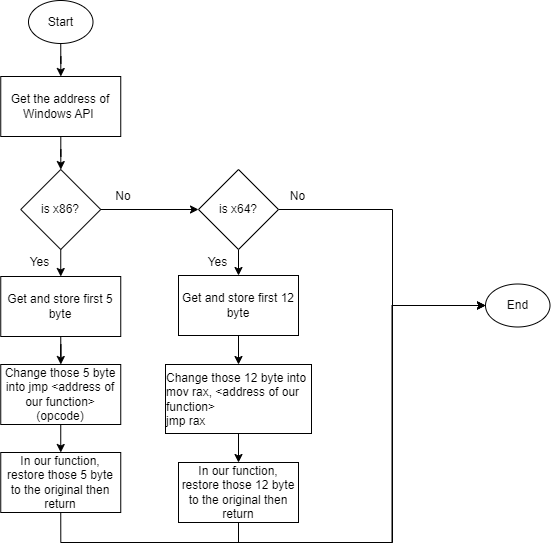

Hook API is a technique of redirecting a Windows API call to our own customed function. In this blog post, I will discuss hooking in windows x86 (32 bit) and x64 (64 bit) by going over of hooking MessageBoxA function to display other content instead of user given content.

The process of hooking in general can be seen as followed:



<br>

The purpose of changing a few first memory addresses is when that Windows API is called, RIP will point to the first instruction of that Windows API. In this situation, RIP will call a set of instruction to jump to our function first, then we do our malicious thing, restore those bytes and return. After this, the hooked function will resume its execution normally.

For x86 machine, memory address is stored by 4 bytes and jmp instruction can be called directly to the memory address. jmp is 1 byte, that's why we need to take 5 bytes out


For x64 machine, memory address is stored by 8 bytes and jmp instruction cannot be called directly to the memory address. We need to place that address into rax register and jmp to that register. jmp is 1 byte, rax is 2 byte, and memory address is 8 byte. The total is 12 bytes

 

With that in mind, we can construct our code like this

```cpp
#include <windows.h>
#include <iostream>
 
using namespace std;

BYTE *msgbox;
BYTE originalBytes[12] = {0};

int FunctionHookTo(HWND hwnd, LPCSTR lpText, LPCSTR lpCaption, UINT uType);

bool DeleteHook(){
    DWORD original_protection;

    VirtualProtect(msgbox, 12, PAGE_EXECUTE_READWRITE, &original_protection);

    for (int i = 0; i < 12; i++){
        *(DWORD64*)(msgbox + i) = *(DWORD64*)(originalBytes + i) ;
    }

    VirtualProtect(msgbox, 12, original_protection, &original_protection);

    return true;
}

bool SetHook(){
    DWORD original_protection;

    VirtualProtect(msgbox, 12, PAGE_EXECUTE_READWRITE, &original_protection);

    for (int i = 0; i < 12; i++){
        *(DWORD64*)(originalBytes + i) = *(DWORD64*)(msgbox + i);
    }

    *(BYTE *)(msgbox) = 0x48;
    *(BYTE *)(msgbox + 1) = 0xB8; //mov rax, ...
    *(DWORD64 *)(msgbox + 2) = FunctionHookTo;
    *(BYTE *)(msgbox + 10) = 0xFF;
    *(BYTE *)(msgbox + 11) = 0xE0; // jmp rax

    VirtualProtect(msgbox, 12, original_protection, &original_protection);

    return true;
}

int FunctionHookTo(HWND hwnd, LPCSTR lpText, LPCSTR lpCaption, UINT uType){
    int r;
    cout << "Hello" << endl;
    DeleteHook();
    r = MessageBoxA(hwnd, "Hooked", lpCaption, uType);
    SetHook();
    return 0;
}

void LaunchMessageBox(LPCSTR text, LPCSTR caption){
    MessageBoxA(0, text, caption, MB_OK);
}

int main(){
    msgbox = (BYTE *)GetProcAddress(GetModuleHandleA("user32.dll"), "MessageBoxA");

    SetHook();

    while (true){
        string launch_msg_box;
        string text, caption;

        cout << "Launch message box? (y/n): ";
        cin >> launch_msg_box;
        if (launch_msg_box == "y"){
            cout << "Text = ";
            cin >> text;
            cout << "Caption = ";
            cin >> caption;
            cout << endl;
            LaunchMessageBox(LPCSTR(text.c_str()), LPCSTR(caption.c_str()));
        }
    }

    cout << "Finish" << endl;
}
```

User specify message box with one caption and content, but displayed message box will have attacker's adjustment


