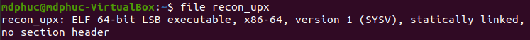
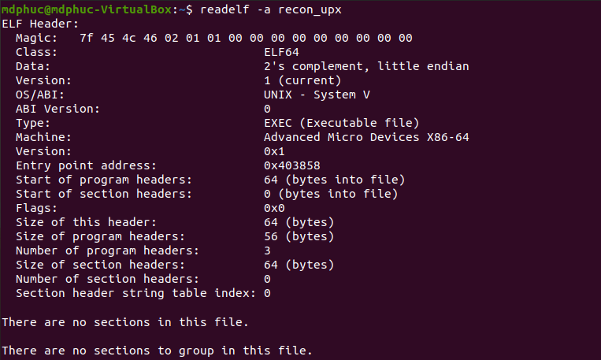
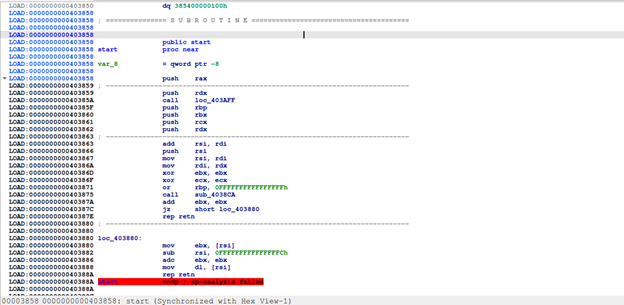

# Recon_upx: The analysis of UPX-packed file

*Aug 12 2024*

#### File: <a href="./File/recon_upx">recon_upx</a>

In this blog post, I'll be discussing the use of IDA in performing static and dynamic analysis and unpacking a malware file. For more information related to IDA, visit <a href="https://hex-rays.com/ida-pro/" target="_blank">https://hex-rays.com/ida-pro/</a>. IDA example: <a href="https://www.hackers-arise.com/post/2017/06/22/Reverse-Engineering-Malware-Part-3-IDA-Pro-Introduction" target="_blank">https://www.hackers-arise.com/post/2017/06/22/Reverse-Engineering-Malware-Part-3-IDA-Pro-Introduction</a>

First thing first, we'll use file command to get the information about the architecture of the file ```file ./recon_upx```


<br>

It's pointed out that recon_upx is actually an ELF 64 bit file (built specifically to run on Linux/UNIX). The file is statically linked and no section header. Normally, for a basic ELF file, there are ```.text```, ```.bss```, and ```.data``` section headers. This is to say that this ELF file is probably packed. The malware will unpack itself during run time, and then continue executing malicious code.

```readelf -a ./recon_upx``` also validates the packed state of recon_upx as explained above


<br>

Our task here is first to unpack the file, then to analyze the file. For unpacking, we'll use IDA. Let's first load the program in IDA:


<br>

According to readelf's output, once the program runs, EIP will first point to the entry point address ```0x403858``` (which is the address of ```start```)

Going through many instructions below, 